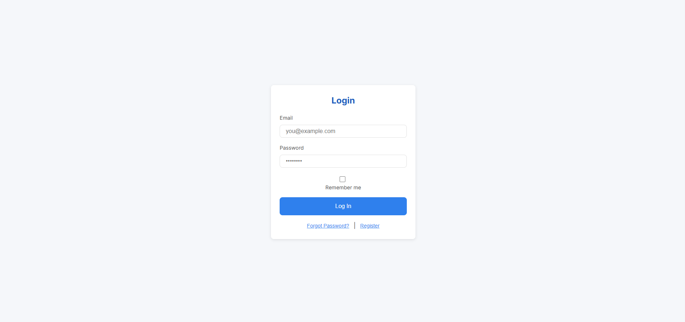
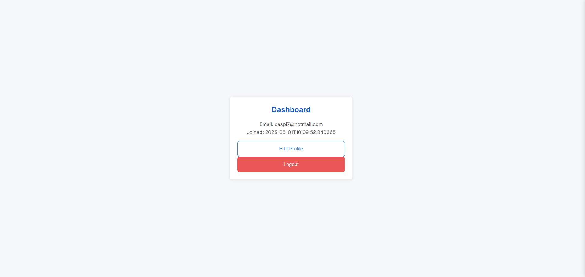

# User Authentication System

A full-stack user authentication system built with Flask (Python backend) and JavaScript/HTML/CSS (frontend). This system supports user registration with email verification, JWT-based login/logout, password reset, and a protected dashboard. Designed to be clear, modular, and easily extendable.

---

## 📁 Project Structure

```
project/
├── backend/
│   ├── app.py               # App entry point
│   ├── config.py            # Configuration file
│   ├── extensions.py        # Flask extensions (DB, Mail, etc.)
│   ├── models.py            # SQLAlchemy models
│   ├── routes.py            # Authentication and user-related routes
│   └── tests/
│       └── test_auth.py     # Unit tests for authentication logic
├── frontend/
│   ├── index.html           # Login & registration page
│   ├── dashboard.html       # User dashboard after login
│   ├── styles.css           # Styling
│   └── script.js            # Frontend logic
└── README.md                # Project documentation
```

---

## 🚀 Setup Instructions

1. **Clone the repository**

```bash
git clone <your_repo_url>
cd project
python -m venv venv
venv\Scripts\activate
pip install -r requirements.txt
```

2. **Configure the backend**

Update the sensitive credentials directly in `config.py` (since no `.env` file is used):

```python
MAIL_USERNAME = 'your_email@gmail.com'
MAIL_PASSWORD = 'your_app_password'
MAIL_DEFAULT_SENDER = MAIL_USERNAME
SQLALCHEMY_DATABASE_URI = 'your_database_url'
JWT_SECRET_KEY = 'your_jwt_secret'
```

3. **Run the app**

```bash
python backend/app.py
```

The app runs at [http://localhost:5000](http://localhost:5000)

---

## 📄 API Documentation

### POST `/register`
- Registers a new user. Requires: `email`, `password`, `confirm`
- Sends an email with a verification link

### GET `/verify-email/<token>`
- Verifies user email from a link

### POST `/login`
- Authenticates a user. Requires `email`, `password`
- Returns JWT token

### GET `/dashboard`
- Returns user info (JWT required in `Authorization` header)

### POST `/reset-request`
- Sends password reset link via email

### POST `/reset-password/<token>`
- Resets password using link

---

## 🧪 Testing Instructions

```bash
pytest -v
```

All unit tests for the authentication system are located in:
```
backend/tests/test_auth.py
```

Tests include:
- Registration validation (including password strength)
- Email verification flow
- JWT login and dashboard access

---


## 📸 Screenshots

| Login Page         | Dashboard Page      |
|--------------------|---------------------|
|  |  |

---

## 📝 Additional Notes

- All passwords are hashed with bcrypt
- JWT tokens expire in 2 hours by default
- Passwords must be 8+ characters, with upper/lowercase, digit, and special character
- No caching is applied to HTML pages to avoid sensitive data persistence

---

## 🔒 Security Assumptions

- All tokens are securely generated and stored
- Email-based verification and password reset are time-limited (24h)

---

## ✍️ Author

Roy Caspi